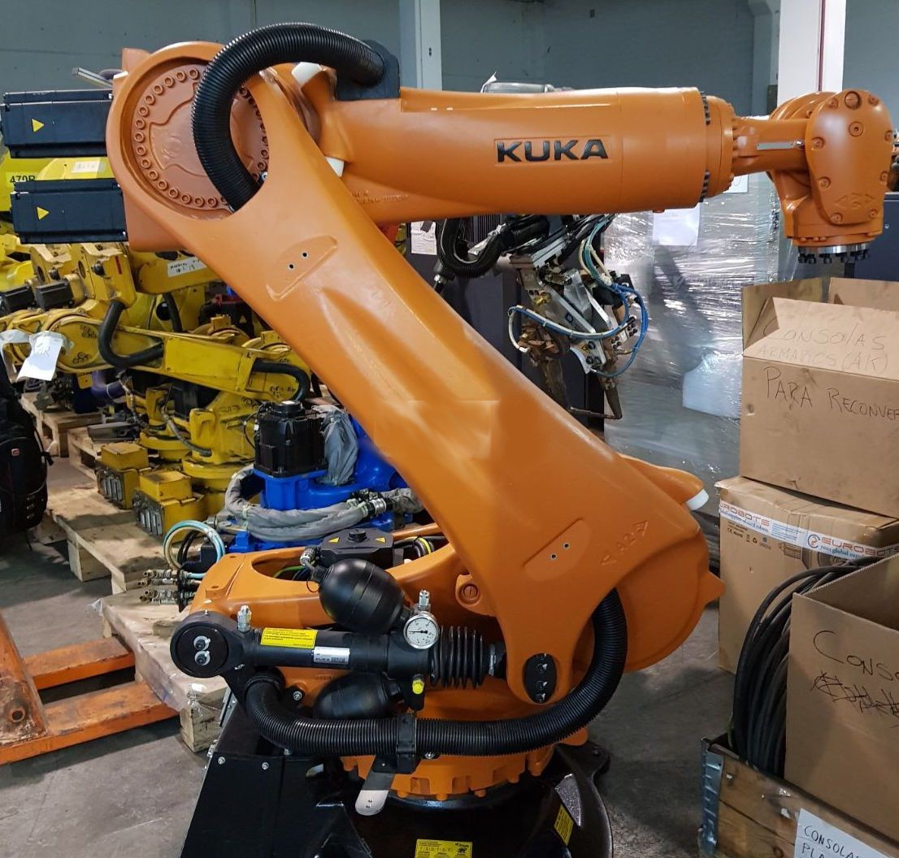

```{r setup, include=FALSE}
knitr::opts_chunk$set(echo = TRUE)
library(ggpubr)
library(car)
library(lattice)
library(plyr)
servo <- read.csv("C:\\Statistics_Labs\\L4_Disperse\\data\\servo.data")
servo$motor <- as.factor(servo$motor)
servo$screw <- as.factor(servo$screw)
servo$pgain <- as.factor(servo$pgain)
servo$vgain <- as.factor(servo$vgain)
```

#  Variance analysis
\
\



\
\

# Introduction

The ***servo*** dataset contains experimental data of servo system. *motor* and *screw* variables describe the properties of the system input processor. *pgain* reacts instantly to the tracking error but can't eliminate tracking error completely. *vagin* is the measure of response. *error* is the time, needed to achieve the desired output.

# Data summary
```{r}
head(servo)
```
Though *pgain* and *vgain* variables are of type integer, we shall consider them as factors to build a multi-factor anova model.

# Exploratory analysis

## Boxplot
```{r}
ggboxplot(servo, x = "motor", y = "error", 
          color = "motor", palette = c("blue", "purple", "green", "red", "orange"),
          ylab = "Tracking error", xlab = "Motor")
```
\
## Mean plots
```{r}
ggline(servo, x = "motor", y = "error", 
       add = c("mean_se", "jitter"), 
       ylab = "Tracking error", xlab = "Motor")
```

# Grouped by motor

$$
\begin{aligned}\large
y_{ik} = \mu + \alpha_i + \epsilon_{ik},\  i = 1..I,\  k=1..N_i
\end{aligned}
$$

$$
\begin{aligned}\large
y=X\alpha+\epsilon
\end{aligned}
$$

```{r}
agr <- ddply(servo, .(motor), summarize, motorMean=mean(error))
meanColours = c("blue", "purple", "green", "red", "orange")
xyplot(motor~error, group = motor, data = servo, cex = 0.9,
       panel=function(x,y,...) { 
         panel.xyplot(x,y,...) 
         panel.abline(v=agr$motorMean, col=meanColours, lwd="2") 
       })

```

# One-way ANOVA

```{r}
oneway <- aov(log(error) ~ motor, data=servo)
summary(oneway)
```

# Multiple pairwise comparison

```{r}
m2 <- lm(log(error) ~ motor, data=servo)
summary(m2)
TukeyHSD(oneway)
```

# Homogeneity of variance assumption

```{r}
leveneTest(log(error)~motor, data=servo)
plot(oneway, 1)
plot(oneway, 2)
```

# Normality assumption
```{r}
shapiro.test(x=oneway$residuals)
kruskal.test(log(error)~motor, data=servo)
```


